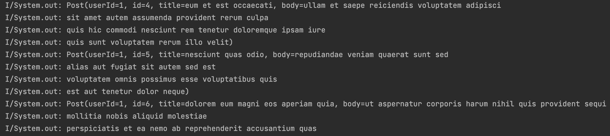
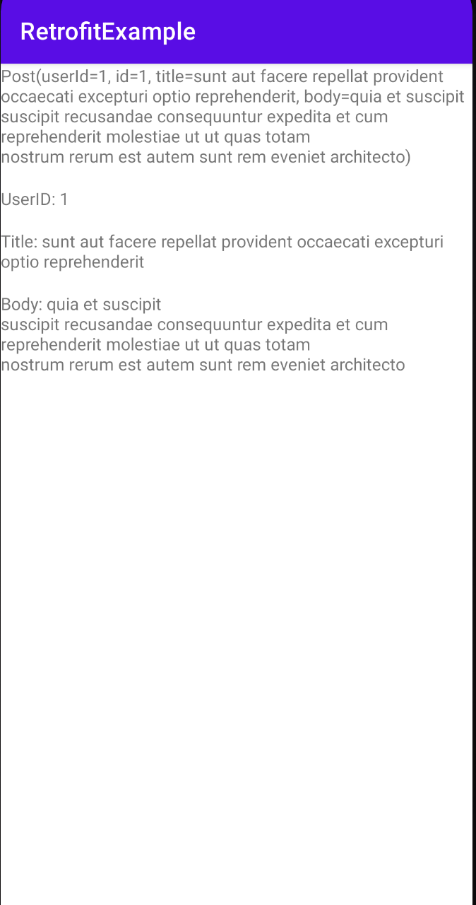

# Retrofit이란?
- 네트워크 통신을 처리하기 위한 라이브러리로 RESTful API와 상호작용하고 서버로부터 데이터를 가져오는 작업을 단순화 하는 도구
- 주로 안드로이드 앱에서 서버로 HTTP 요청을 보내고 응답을 처리하기 위해 사용
- JSON 또는 XML과 같은 데이터 형식을 처리하고, 비동기적으로 서버 요청을 수행하여 안정적인 앱을 만들 수 있도록 돕는 역할

 

# Retrofit의 장점
- 간편한 사용: HTTP API 호출을 간단하게 처리
- 안정성: 타입 안정성을 보장하여 오류를 미리 방지
- HTTP 요청 관리
- 스레드 관리: RxJava, Kotlin Coroutines 등과 쉽게 통합하여 비동기 작업을 처리 가능

 

# Retrofit의 단점
- 처리 과정 이해 필요
- 복잡성 증가

 

# Retrofit의 구성요소
- Retrofit 객체
- HTTP 요청 메서드: GET, POST, PUT, DELETE 등
- Annotations

 

# Retrofit으로 받아온 POST List 출력

  

# POST 값 단일 단위 출력

  

# 진행 단계
- 프로젝트 생성
- Gradle 추가
- Permission 설정 (인터넷 권한)
- DTO 생성 (DTO 명: Post.kt)
- Interface 정의 (Ingerface 명: JsonPlaceholderService.kt)
- Retrofit 인스턴스 생성 (Mainactivity.kt 참고)
- 결과 출력 및 테스트 UI 구성